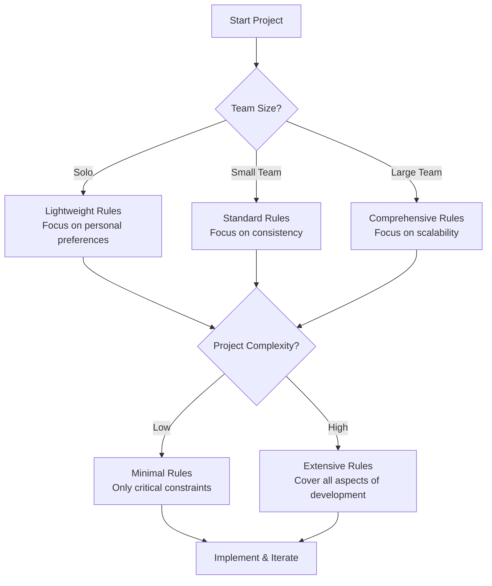

# Efficiency Handbook 1: Ultimate Cursor Rules & Best Practices Guide

*A definitive, community-backed manual for configuring Cursor to work precisely how you want. This guide merges strategic frameworks with production-tested implementation patterns.*

---

## 📌 Core Golden Rules
1. **Start Small and Iterate**: Begin with 3-5 critical rules. Don't over-engineer upfront.
2. **Explicit Context**: Use `@file` or `@code` features. Rules define *how* to use context; they don't replace it.
3. **Specific & Actionable**: Avoid "Write clean code." Use "Functions must be under 50 lines and have a single responsibility."
4. **Ruthless Minimalism**: Short, imperative commands ("NEVER do X") are harder for the AI to ignore than long, polite requests.
5. **Review & Test**: Never blindly commit AI-generated code. Run linters, tests, and manual checks.

---

## 🏗️ The Reliability Hierarchy
When deciding where to place instructions, follow this order for maximum compliance:

| Location | Reliability | Best For |
| :--- | :--- | :--- |
| **Global "Rules for AI"** | ⭐⭐⭐⭐⭐ | **Personality & Thinking Style**: "Think step-by-step," "No lazy coding," "Explain before code." |
| **`.cursor/rules/*.mdc`** | ⭐⭐⭐⭐ | **Knowledge & Context**: Tech stack, architecture patterns, naming conventions, library usage. |
| **Legacy `.cursorrules`** | ⭐⭐ | **Legacy Root Config**: Still supported but often deprioritized compared to modular `.mdc` files. |

---

## 🔑 The "Golden Rule" for Global Settings
Adding this block to **Settings → General → Rules for AI** is the single most effective way to improve Cursor's reasoning:

> **Always think step-by-step before you write any code.**  
> **Explain your reasoning clearly and in detail before proposing any code changes.**  
> **Only after you have fully explained your plan should you output the code.**  
> **Never output code without preceding explanation.**  
> **Fix root causes, not just the symptom.**

---

## 🏗️ Recommended Project Structure
Keep your `.cursor/rules/` directory modular and focused (aim for 5-8 files max):

```text
.cursor/rules/
├── 00-core.mdc          # (alwaysApply: true) Project overview & core philosophy
├── naming.mdc           # Strict naming conventions (file/variable naming)
├── frontend.mdc         # (globs: "**/*.tsx") React, Tailwind, and UI component standards
├── backend.mdc          # (globs: "**/api/**") API, DB, and Server-side patterns
├── testing.mdc          # Testing libraries, coverage requirements, and AAA structure
└── tech-stack.mdc       # Version-specific anchors (e.g., "Next.js 14 App Router only")
```

---

## 📝 Writing Effective `.mdc` Rules
### 1. Mandatory Frontmatter
Rules will be ignored if the YAML frontmatter is missing or malformed.
```yaml
---
description: React component standards
globs: "**/components/**/*.{tsx,jsx}"
alwaysApply: false
---
```

### 2. Content Best Practices
- **Be Imperative**: Use "Use function components" instead of "Please consider using..."
- **Be Concise**: Keep files under 30-40 lines.
- **Show, Don't Just Tell**: Always include **Good vs. Bad** code snippets.

---

## 🚀 Advanced Techniques
### Dynamic Rule Loading
Use environment variables to toggle different behaviors (e.g., stricter testing rules in staging):
```bash
CURSOR_RULES_ENV=production cursor generate-code
```

### Automation & Self-Improvement
Teal the AI to help you maintain its own rules by adding a `self-improvement.mdc`:
```markdown
# Rule Maintenance
1. New pattern appears in 3+ files → Suggest a new `.mdc` rule.
2. Better pattern found during refactor → Update existing rules.
```

### Collaborative PR Workflow
Treat your rules as code. Use Pull Requests to discuss changes:
- **Rationale**: Why are we adding this constraint?
- **Testing**: Did this rule prevent any hallucinations in current tasks?

---

## ⚠️ Common Pitfalls & Decision Framework

| Pitfall | Problem | Solution |
| :--- | :--- | :--- |
| **Context Overload** | Too many `alwaysApply: true` rules flood the memory. | Use specific `globs`. Load rules only when needed. |
| **Ambiguity** | "Write good code" leads to inconsistent behavior. | Use measurable criteria (e.g., "Max complexity score of 10"). |
| **Model Bias** | Claude may prioritize speed over your "Think first" rule. | Start a **New Chat** the moment reasoning slips. |

### When to use Cursor Rules?


---

## 💎 Key Takeaways
- **Global Rules** handle **Thinking/Behaving**.  
- **`.mdc` Rules** handle **Knowledge/Coding Patterns**.  
- **Version Control** your rules and update them every month.  
- **Verify** by asking Cursor: *"What rules are currently active for this file?"*
# 300 Sessions Later: What Actually Works (Data-Backed Guide)

*Insights from extensive tracked coding sessions. A statistical look at what leads to successful agent interactions.*

---

## 📊 The Data
- **High Productivity**: 62%
- **Mediocre**: 28%
- **Disaster**: 10%

---

## 🏆 The "Winning" Patterns (>70% Success Rate)

### 1. The 3-Line Global Guardrail
*Used in 92% of best sessions.*
1.  **Thinking**: Show full reasoning first.
2.  **Completeness**: No placeholders/ellipses.
3.  **Governance**: Call out deviations from project patterns immediately.

### 2. The Master Context File (`project-memory.md`)
*Used in 85% of best sessions.*
- A single 1-2 page markdown file summarizing architecture, patterns, and tech debt.
- **Usage**: Referenced at the start of every session.

### 3. The Loop: Plan → Step → Roast
*78% Success Rate (vs 32% for one-shot prompts).*
1.  **Plan**: "Create `plan.md`."
2.  **Execute**: "Do Step 1."
3.  **Review**: "Roast Step 1."

### 4. Self-Critique
*Caught 65% of bugs.*
- Always ask the AI to "roast" its own code before you run it.

---

## 💥 The "Disaster" Patterns (Avoid These)
1.  **Context Dumping**: Pasting 50 files blindly makes the model "stupid".
2.  **Long Rules**: Rule files > 10 lines get ignored.
3.  **Vague Prompts**: "Build the app" = Failure.
4.  **Skipping the Plan**: Going straight to code led to architectural mess.
# Cursor Agent Core Rules

*Fundamental principles, tool strategies, and coding standards for AI Agents in Cursor.*

---

## 🧠 Core Principles
1.  **Context Efficiency**: Never load the entire codebase. Use targeted search.
2.  **Targeted Reading**: Search first (`grep`), then read specific files (`read_file`).
3.  **Tool Selection**: Use the precise tool for the job (e.g., `perplexity` for external facts, `codebase_search` for internal logic).

---

## 🛠️ Tool Selection Strategy

### Information Gathering
| Need | Tool |
| :--- | :--- |
| **Local Code Logic** | `codebase_search`, `grep_search` |
| **Quick Facts (API/Docs)** | `perplexity_ask` |
| **Tech Comparisons** | `perplexity_reason` |
| **Deep Market Research** | `perplexity_research` |
| **Library Documentation** | `Context7` (via `get_library_docs`) |
| **General Web** | `web_search` |

### Development Workflow
| Task | Tool |
| :--- | :--- |
| **Code Edits** | `edit_file` |
| **Testing/Git** | `run_terminal_command` |
| **Database Read** | `PostgreSQL MCP` |
| **Database Write** | `terminal` (migrations) |

---

## 💻 Coding Standards

### File Size Limits
- **Components**: 150-300 lines (Split if larger).
- **Logic Files**: 300-500 lines max.

### Architecture
- **Purity**: Write small, pure functions.
- **Modularity**: Treat routes as self-contained modules.
- **Safety**: Strict TypeScript; Static imports only.

### Testing
- **Mandate**: Write tests for every new feature.
- **Loop**: Run tests → Fix → Run tests until green.
- **Storage**: Save successful test patterns to `Memory MCP`.

---

## 🛡️ Security & Errors

- **Validation**: Validate ALL external inputs and API responses.
- **Secrets**: Never text-dump credentials. Use env vars.
- **Write Safety**: Be cautious with terminal write commands (rm, drop table).
- **Fallback**: Have a plan if an MCP tool (like Perplexity) times out.
# Base AI Rules: The "Classic" Foundation

*Insights from influential early discussions, where the community converged on a concise Global Rule set that remains effective.*

---

## 🏛️ The "Classic" Global Block

This specific set of instructions was shared by u/Adorable_Buyer2490 and validated by the community as a reliable baseline for "Rules for AI" (Global Settings).

```text
Always think step-by-step before writing any code or making suggestions.
Explain your reasoning in detail before proposing changes or code.
Never output code without a clear, preceding explanation and plan.
Prioritize clean, readable, maintainable code over clever shortcuts.
Follow existing project style, conventions, and patterns exactly.
If anything is ambiguous, ask for clarification instead of assuming.
Output complete code blocks – no placeholders, ellipses, or "rest unchanged".
Be concise but thorough – no unnecessary verbosity unless asked.
```

### Why It Sustains Time
1.  **Anti-Laziness**: The "No Placeholders" rule directly combats the #1 user complaint.
2.  **Anti-Hallucination**: The "Think Step-by-Step" + "Explain First" loop forces the model to ground itself before generating syntax.
3.  **Low Token Cost**: Its brevity ensures it is rarely truncated, even in large contexts.

---

## 📈 Evolution of Thought

### Early Feedback
- **Problem**: Users struggled with inconsistent application ("It ignores rules in long chats").
- **Solution**: The community realized that putting these behavioral rules in **Global Settings** worked far better than project files.

### Modern Refinements
Later iterations (like the "Anti-Garbage" set) added:
- "Fix root causes, not symptoms."
- "Suggest incremental changes."

---

## 🛠️ Implementation Advice

If you are new to Cursor rules, **start here**.

1.  Copy the block above.
2.  Paste it into **Settings → General → Rules for AI**.
3.  Use it as your foundation. Only add Project Rules (`.mdc`) for specific technical knowledge (Stack, Naming, Libraries).
# Cursor Employee Rules for AI (Internal "Dogfooding" Style)

*Insights from early community discussions revealing the rules used by Cursor employees to build Cursor itself.*

---

## 🏆 The Core Insight: "Builders == Users"

When the team building the AI editor uses it exclusively to build the product ("dogfooding"), they converge on a specific rule style: **Concise, High-Priority, and Implementation-First.**

The shared philosophy is:
> **Elite UX emerges when rules enforce discipline, not just suggestions.**

---

## 📜 The Shared Rule Block (Verbatim Style)

This block (or close variations) is what employees reportedly used in their **Global Rules for AI** (Settings → General). It focuses on eliminating "lazy AI" behaviors.

```text
You are an expert engineer building high-quality software.

Core directives (always follow):
1. Think step-by-step deeply before suggesting changes.
2. Explain your reasoning clearly before outputting any code.
3. NEVER output incomplete code, placeholders, or ellipses ("...").
4. Always provide full, ready-to-aply code blocks.
5. Prioritize simplicity, readability, and maintainability.
6. Respect existing code style and patterns exactly.
7. If unsure, ask for clarification – do not assume.
8. Suggest incremental changes over massive rewrites.
```

*Note the emphasis on "NEVER output incomplete code" – a direct counter to the common "lazy coder" problem.*

---

## 🧠 Why This Works (The "Secret Sauce")

1.  **Placement**: These are **Global Rules**, injected at the system level for every request. This ensures consistent "personality" across all projects.
2.  **Brevity**: By keeping it short (under 10-15 lines), the rules avoid token dilution and stay high-priority in the context window.
3.  **Discipline**: It forces the model to slow down (Chain of Thought) and finish the job (Complete Code), fixing the two biggest UX complaints.

---

## 🛠️ Implementation Strategy

To replicate the "Cursor Employee Experience":

1.  **Global Rules**: Paste the block above into **Settings → General → Rules for AI**.
2.  **Project Rules (`.mdc`)**: Use project files *only* for specific knowledge (Stack versions, Naming, Architecture). **Do not duplicate the global rules here.**
3.  **Iterate**: If the AI slips, add a specific imperative line (e.g., "Always use X pattern") to the relevant project rule, not the global block.

---

## 💡 Community Validation

This "Employee Style" remains the foundation for most high-performance setups (like the "Anti-Garbage" rules). It proves that **strong behavioral constraints** are more valuable than lengthy, vague instructions.
# How to Set Up Good Cursor Rules (Iterative Approach)

*Practical advice from r/cursor on creating reliable, high-quality rule sets.*

---

## 🔄 The "Good" Strategy: Iteration > Perfection

The consensus is that you cannot write perfect rules on day one. Instead, you must **grow them** organically.

### The "Mistake-Driven" Improvement Loop
Every time Cursor makes a mistake (e.g., uses a placeholder, forgets a naming convention, hallucinates an import):

1.  **Stop**: Don't just fix the code.
2.  **Prompt**:
    > "You made a mistake [describe mistake]. Valid code should look like [example]. Update the relevant `.mdc` rule file to explicitly prevent this exact error in the future. Use imperative 'NEVER'/'ALWAYS' language."
3.  **Result**: Your rules get sharper and more specific with every session.

---

## 🏗️ The "Index File" Pattern

For larger projects, users recommend a master index to Organize the context.

**File**: `.cursor/rules/00-index.mdc`
**Config**: `alwaysApply: true`

```markdown
---
description: Master index for project rules. Always active.
alwaysApply: true
---
# Rule Index

## Project Core
- **Goal**: [Short Project Goal]
- **Stack**: [Key Tech Stack]

## Active Rule Sets
(Cursor automatically loads these based on context, but enforce awareness here)
- **Frontend**: See `frontend-rules.mdc` for React/Tailwind.
- **Backend**: See `backend-rules.mdc` for API/DB patterns.
- **Conventions**: See `naming.mdc` for file/variable naming.
```

---

## ✅ The "Checklist" Enforcer

One of the most effective hacks for compliance is forcing the AI to self-grade.

**Add this to your Global Rules:**
> "Before outputting code, verify your plan against the active rules. Output a brief checklist confirmation:
> - [ ] Naming conventions followed?
> - [ ] Root cause addressed?
> - [ ] No placeholders used?"

*Users report this simple step drastically reduces "lazy" errors.*

---

## 🛠️ Setup Tips for Reliability

1.  **Start with Gen-AI**: Don't write from scratch. Ask Cursor: *"Analyze my codebase and generate a starter set of `.mdc` rules representing my current patterns."*
2.  **Layering**:
    - **Global**: Behavior (Thinking, Checklists).
    - **Index `.mdc`**: Context map.
    - **Specific `.mdc`**: Hard knowledge.
3.  **Maintenance**: Rules are "living documents". Review them weekly. If a rule is never triggered or often ignored, delete or sharpen it.

---

## ⚠️ Reality Check
- **Consistency**: Even with great rules, LLMs (Claude/GPT-4) sometimes drift. The **best fix** is nearly always:
  1. Clear Context (New Chat).
  2. Remind: "Follow the active rules in `.cursor/rules/`."
# How to Set Up High-Quality Cursor Rules (Iterative Approach)

*Practical advice from r/cursor on creating reliable, high-quality rule sets through iteration and structure.*

---

## 🔄 The "Good" Strategy: Iterate & Improve

The consensus is that you cannot write perfect rules on day one. Instead, you must **grow them** organically using a feedback loop.

### The "Mistake-Driven" Improvement Loop
Every time Cursor makes a mistake (e.g., uses a placeholder, forgets a naming convention, hallucinates an import):

1.  **Stop**: Don't just fix the code manually.
2.  **Prompt**:
    > "You made a mistake [describe mistake]. Valid code should look like [example]. Update the relevant `.mdc` rule file to explicitly prevent this exact error in the future. Use imperative 'NEVER'/'ALWAYS' language."
3.  **Result**: Your rules get sharper and more specific with every session, creating a compounding effect.

---

## 🏗️ The "Index File" Pattern

For larger projects, users recommend a master index to organize the context and act as a hub.

**File**: `.cursor/rules/00-index.mdc`
**Config**: `alwaysApply: true`

```markdown
---
description: Master index for project rules. Always active.
alwaysApply: true
---
# Rule Index

## Project Core
- **Goal**: [Short Project Goal]
- **Stack**: [Key Tech Stack]

## Active Rule Sets
(Cursor automatically loads these based on context, but enforce awareness here)
- **Frontend**: See `frontend-rules.mdc` for React/Tailwind.
- **Backend**: See `backend-rules.mdc` for API/DB patterns.
- **Conventions**: See `naming.mdc` for file/variable naming.
```

---

## ✅ The "Checklist" Enforcer

One of the most effective hacks for compliance is forcing the AI to self-grade or generate pre-implementation checklists.

**Add this to your Global Rules:**
> "Before outputting code, verify your plan against the active rules. Output a brief checklist confirmation:
> - [ ] Naming conventions followed?
> - [ ] Root cause addressed?
> - [ ] No placeholders used?"

*Users report this simple step drastically reduces "lazy" errors and improves adherence.*

---

## 🛠️ Setup Tips for Reliability

1.  **Start with Gen-AI**: Don't write from scratch. Ask Cursor: *"Analyze my codebase and generate a starter set of `.mdc` rules representing my current patterns."*
2.  **Layering**:
    - **Global**: Behavior (Thinking steps, Checklists).
    - **Index `.mdc`**: Context map / Hub.
    - **Specific `.mdc`**: Hard knowledge (APIs, naming).
3.  **Maintenance**: Rules are "living documents". Review them periodically. If a rule is never triggered or often ignored, delete or sharpen it.
4.  **Targeted Globs**: Use specific globs (e.g., `**/controllers/**.rb`) to prevent context dilution.

---

## ⚠️ Reality Check
- **Consistency**: Even with great rules, LLMs sometimes drift (especially with model updates).
- **The Fix**:
  1. Clear Context (New Chat).
  2. Remind: "Follow the active rules in `.cursor/rules/`."
  3. Reload Window (`Ctrl/Cmd+R`) if rules seem stuck.
# The Evolution of Cursor Rules: Lessons from Legacy `.cursorrules`

*A retrospective analysis of why the legacy single-file `.cursorrules` approach failed and how modern workflows have solved those issues.*

---

## 📉 Why Legacy `.cursorrules` Failed

In earlier iterations of AI coding tools, users frequently reported that their carefully crafted, single-file `.cursorrules` were ignored. The common failure patterns included:

1.  **Context Dilution**: In long chats or large projects, the rule file (which lacked robust loading logic) got buried deep in the context window.
2.  **Degradation**: Rules worked for the first 5-10 messages, then the AI would revert to default behaviors (lazy coding, placeholders, hallucinations).
3.  **Low Priority**: The file was often treated as just another piece of context rather than a strict system instruction.

---

## 🚀 The Modern Solution: Global + Modular `.mdc`

The community and Cursor team developed a "Split Responsibility" model that solved these consistency issues.

### 1. The "Behavior" Layer (Global Rules)
**Moved to:** Settings → General → Rules for AI.
**Why:** This is injected at the system level for *every* request, making it immune to context dilution.
**Use For:**
- "Think step-by-step and explain plan first."
- "Never use placeholders (`//...`)."
- "Fix root causes."
- "Ask for clarification."

### 2. The "Knowledge" Layer (Project `.mdc`)
**Moved to:** `.cursor/rules/*.mdc` (with Frontmatter & Globs).
**Why:** Selective loading means rules are only injected when relevant, keeping the context clean.
**Use For:**
- Tech stack versions ("Rails 7", "Next.js 14").
- Naming conventions (`PascalCase` vs `camelCase`).
- Architecture patterns ("Use Service Objects", "Client-side DB wrappers").

---

## 🛠️ The Migration Checklist

If you are still using a root `.cursorrules` file, follow this path to modernize:

1.  **Extract Behavior**: Copy your "personality" rules (thinking style, formatting) into **Global Rules**.
2.  **Modularize Knowledge**: Split your stack-specific rules into small `.mdc` files:
    - `tech-stack.mdc`
    - `naming.mdc`
    - `testing.mdc`
3.  **Add Frontmatter**: Ensure every `.mdc` file has valid YAML headers with specific globs.
4.  **Delete Legacy**: Remove the old `.cursorrules` file to prevent conflicts.

---

## 💡 Pro Tip: The "Recall" Test

To see if your migration worked, open a new chat and ask:
> "What specific project rules and behavioral guidelines are active right now?"

The AI should clearly valid both your **Global Rules** (behavior) and the relevant **Project Rules** (knowledge) for the open file.
# Reddit Community Insights: Effective Cursor AI Rules

*A compilation of battle-tested rules and best practices from the r/cursor community (u/Anxious_Nose9057 and others), focusing on what actually impacts AI behavior.*

---

## 🔑 Core Finding: Global vs. Project Rules

**The Insight**: Project-specific `.cursorrules` files are often ignored or have a weak effect.
**The Fix**: Instructions placed in the **global "Rules for AI"** section (Settings → General → Rules for AI) are significantly more reliable and consistently influence AI behavior.

---

## 🏆 The "Actually Works" Rule

The specific rule cited as making the biggest difference is this thinking/planning instruction:

```text
Always think step-by-step before you write any code.
Explain your reasoning clearly and in detail before proposing any code changes.
Only after you have fully explained your plan should you output the code.
Never output code without preceding explanation.
```

### Why it works
- **Internal Re-prompting**: Forces the model (Claude/Sonnet) to utilize its Chain-of-Thought capabilities.
- **Feedback Loop**: Creates a sequence where the model plans, validates its own logic, and then codes, reducing hallucinations.

---

## ⭐ Top Recommended Rule Patterns

These are the most "battle-tested" variations recommended by the community:

### 1. Classic Thinking & Planning (Most Popular)
```text
Think out loud step by step. Plan first, then code.
Never write code without a clear plan explained in detail before the code block.
```

### 2. The Strict Planner (For Complex Tasks)
```text
Before writing ANY code:
1. Think step-by-step in detail
2. Explain your full reasoning and plan
3. List potential edge cases & how you'll handle them
Only THEN output the code in a complete fenced block.
Never output code first.
```

### 3. Root Cause & Quality Focus
```text
Always fix issues at the root cause, never just patch the symptom.
Write clean, maintainable, readable code following SOLID principles.
Prefer simplicity over cleverness.
```

### 4. No Placeholders / Complete Code (Essential)
```text
Never leave placeholder comments like // ... rest of the code
Never say "the rest remains unchanged"
Always output the FULL, complete code block/file when suggesting changes.
```

### 5. Coding Standards Checklist
- "Use explicit variable/function names. Avoid abbreviations unless they are industry-standard."
- "Always add proper error handling and logging."
- "Follow the existing code style & conventions of the current file/project."
- "Write unit testable code. Prefer pure functions when possible."
- "Be extremely concise in explanations unless asked for detail."

---

## 🏗️ Implementation Strategy

The consensus for the most effective setup:

### 1. Global Rules (Settings)
**Best for:** General behavior, thinking style, planning discipline, and verbosity.
**Action:** Paste the **Classic Thinking/Planning Rule** here. Keep it short (5-10 lines) and imperative ("Always...", "You must...").

### 2. Project Rules (`.cursor/rules/*.mdc`)
**Best for:** Modern, context-aware instructions.
**Action:** Use these for tech-stack specifics (Next.js, Tailwind, etc.) and project architecture. This replaces the legacy `.cursorrules` file.

### 3. Legacy `.cursorrules` (Root)
**Status:** Often ignored or diluted. Considered the weakest option for critical instructions.

---

## 🚀 Quick Start Recommendation

1.  **Global Settings**: Paste the "Always think step-by-step" rule.
2.  **Project Root**: Create `.cursor/rules/` and add `.mdc` files for specific frameworks.
3.  **Iterate**: Test one rule at a time to verify it actually changes the AI's output style.
# Cursor "Secret Sauce" Rules: Reality vs. Magic

*Insights from "Is there some secret sauce?" discussions (r/cursor), revealing why some setups feel powerful while others fail.*

---

## 🧉 The "Secret Sauce" is Minimalism & Placement

The community consensus is that there is no hidden feature. The perceived "magic" comes from **ruthless prioritization** and correct rule placement.

### 1. The Core Secret: Layering
Successful setups almost always follow this layer strategy:

| Layer | Responsibility | Effectiveness |
| :--- | :--- | :--- |
| **Global Rules** | **Discipline & Personality** (Thinking, Output Format) | ⭐⭐⭐⭐⭐ (Highest) |
| **Project Rules** | **Knowledge & Context** (Stack, Naming, Arch) | ⭐⭐⭐⭐ (High, if strictly scoped) |

*Attempting to put discipline rules ("Think step-by-step") into project files usually dilutes their effectiveness and leads to them being ignored.*

---

## ⚡ The "Secret" Global Prompt (Ultra-Short)

This specific block is cited as the high-impact "sauce" because it is concise enough to always be respected:

```text
You are a 15+ year senior engineer. Always:
1. Think step-by-step in detail before ANY code.
2. Explain full plan + reasoning BEFORE code.
3. NEVER use placeholders, ellipses, or "rest unchanged".
4. Output COMPLETE code blocks only.
5. Fix root causes, not symptoms.
6. Ask if ambiguous – do not assume.
```

---

## 🧬 The Compounding Meta-Rule

To make your AI "get smarter" over time, add this specific rule file to your project:

**File**: `.cursor/rules/00-meta-improvement.mdc`

```markdown
---
description: How to evolve and maintain rules
globs: "**/*"
alwaysApply: true
---
# Meta-Improvement Protocol

When you notice a repeated pattern, a better code example, or inconsistencies:
1. Suggest creating or updating a specific `.mdc` rule.
2. Make suggestions focused, short (<30 lines), and specific.
3. Prefer generating content via `/Generate Cursor Rules`.
4. Commit changes to git so the team benefits.
```

*This small file encourages the AI to help build its own knowledge base.*

---

## 🚫 What Kills the Magic (Pitfalls)

1.  **Overload**: Too many rules or broad `globs: "**/*"` flood the context window, causing the AI to hallucinate or ignore instructions.
2.  **Wrong Place**: Putting behavioral instructions in project rules is weak. Move them to Global.
3.  **Vagueness**: Long, wandering rule descriptions are skipped. Be imperative.

---

## 🧪 The "Taste Test" (Validation)

To verify if your "sauce" is working:
1.  Open a new chat.
2.  Ask: **"List all currently active Cursor rules (global + project) for this context."**
3.  If the AI lists your intended rules, you're good. If not, check globs and `alwaysApply` settings.
